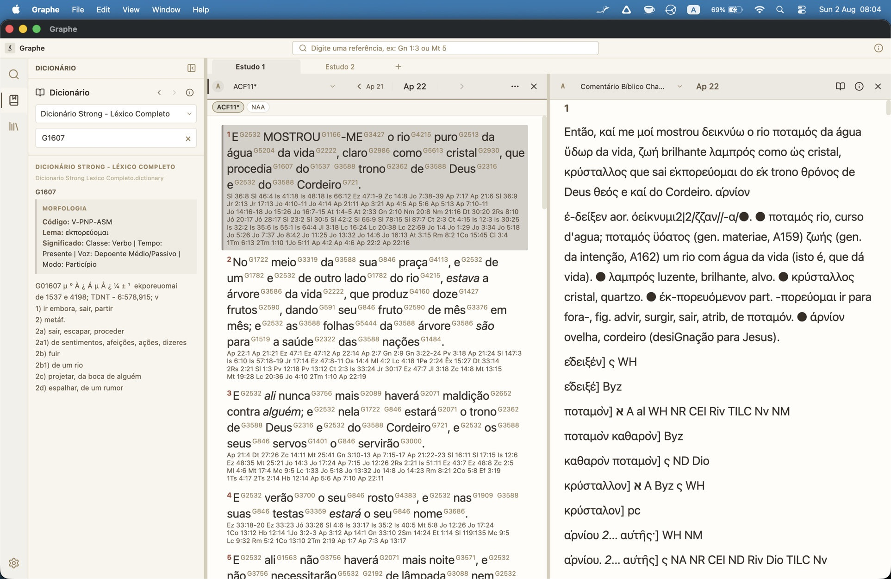

# Graphe

Mais informações e atualizações: [Telegram do Graphe](https://t.me/graphegrupo)

Aplicativo desktop de estudo bíblico, com painéis divididos, números de Strong, referências cruzadas, comentários e dicionários.

Disponível para **Windows**, **Linux** e **macOS**. Gratuito e de código aberto (MIT).



## Download

Baixe a versão mais recente na página de [releases](https://github.com/claudioscheer/graphe/releases/latest).

O app avisa quando há uma versão nova disponível no GitHub.

## Funcionalidades

### Painéis e layout

- Vários painéis bíblicos e de comentário abertos ao mesmo tempo
- Divisão horizontal e vertical (árvore de painéis, como no [VS Code](https://code.visualstudio.com/))
- **Estudos (workspaces):** abas com layouts independentes; criar, renomear e fechar estudos
- Barra lateral (workbench) com:
  - **Pesquisa**
  - **Dicionário**
  - **Módulos** (lista e atalhos de gestão)
- Estado da interface é restaurado ao reabrir o app (painéis, estudos, preferências)

### Traduções e navegação

- Múltiplas traduções lado a lado
- Seletor de módulo com busca e **favoritos**
- Navegação rápida por livro, capítulo e versículo (`F3` ou campo de referência: ex. `Gn 1:3`, `Mt 5`)
- Histórico de navegação por painel (voltar / avançar)
- Painel **fixado** como destino de links (referências e dicionário abrem nele)
- Seleção de versículos com teclado e copiar com `Ctrl+C` / `Cmd+C`

### Números de Strong e interlinear

- Strong's (hebraico e grego) integrados ao texto, quando o módulo traz as tags
- Clique em um número Strong para abrir o dicionário
- Menu de contexto no Strong: buscar ocorrências ou consultar o dicionário
- Vários dicionários Strong configuráveis em **Configurações**
- Cognatos / palavras relacionadas (quando o módulo de dicionário oferece)
- Morfologia e lema resolvidos quando disponíveis no módulo
- Anotações interlineares por palavra (módulos com esses dados), por exemplo:
  - Strong, original, transliteração
  - gloss, pronúncia e referências extras (ex. LN, GK), quando presentes

### Referências cruzadas

- Módulos de referências (ex. Treasury of Scripture Knowledge), escolhidos em Configurações
- Clique na referência para navegar no painel de destino
- Opção de abrir em **modal de prévia** apenas as referências clicadas no painel fixado

### Comentários

- Painéis de comentário sincronizados com um painel bíblico escolhido
- Divisão em horizontal ou vertical só com comentário
- **Todos os comentários:** visão agregada do versículo em todos os módulos de comentário instalados
- Indicador de cobertura do comentário (completo / parcial / sem dados)

### Dicionário

- Painel dedicado na barra lateral
- Busca por tema, prefixo, amostra aleatória e exploração por prefixo
- Lookup a partir de Strong's no texto ou busca manual
- Histórico de consultas no painel

### Pesquisa

- Busca textual na tradução selecionada
- Busca por Strong: `strong:H1234` ou `strong:G5678`
- Frases entre aspas: `"no princípio"`
- Destaque dos termos nos resultados
- `Ctrl`/`Cmd` + clique em um resultado abre em um **novo estudo**

### Módulos (formato MyBible SQLite3)

O Graphe usa módulos no formato **MyBible SQLite3**. O tipo é detectado pelas tabelas do banco:

| Tipo               | Uso                                |
| ------------------ | ---------------------------------- |
| Bíblia             | Texto, Strong's, interlinear       |
| Dicionário         | Strong's e léxicos                 |
| Comentário         | Comentários por versículo/capítulo |
| Referência cruzada | Links entre passagens              |

#### Instalar módulos

1. **File → Install Modules...** (ou **Instalar Módulos** se ainda não houver bíblia instalada)
2. Selecione um ou mais arquivos `.sqlite3`
3. O app copia para a pasta de módulos e recarrega a interface

| Sistema | Pasta de módulos                 |
| ------- | -------------------------------- |
| Linux   | `~/.graphe/modules/`             |
| macOS   | `~/.graphe/modules/`             |
| Windows | `%USERPROFILE%\.graphe\modules\` |

Outros itens de menu:

- **File → Convert Modules...** — conversão integrada (ver abaixo)
- **File → Reload Modules** — recarrega a pasta de módulos
- **Edit → Edit Module Data...** (`Ctrl+E` / `Cmd+E`) — editor de módulo

#### Conversão de módulos

Conversão no próprio app (ou salva o `.sqlite3` ao lado do arquivo original):

| Origem  | Entrada                                                                               | Saída típica                                               |
| ------- | ------------------------------------------------------------------------------------- | ---------------------------------------------------------- |
| theWord | Bíblias `.ont`, `.ontx`, `.nt`, `.ntx`, `.ot`, `.otx`; comentários/dicionários `.twm` | `.SQLite3`, `.commentaries.SQLite3`, `.dictionary.SQLite3` |
| MySword | Bíblias `.bbl.mybible`, dicionários `.dct.mybible`                                    | `.SQLite3` / `.dictionary.SQLite3`                         |

#### Editor de módulo

Permite inspecionar e editar dados do módulo instalado (conforme o tipo):

- Metadados (`info`)
- Nomes de livros
- Texto de versículos
- Entradas de comentário
- Exclusão do módulo

### Interface

- Temas claro e escuro
- Tamanho de fonte ajustável
- Idiomas da interface: **Português**, **Inglês** e **Espanhol** (não altera a tradução bíblica)
- Zoom da janela e tela cheia pelos atalhos nativos do sistema

### Atalhos de teclado

| Atalho                | Ação                                                |
| --------------------- | --------------------------------------------------- |
| `Ctrl+Shift+F`        | Focar na pesquisa                                   |
| `F3`                  | Diálogo de navegação (livro / capítulo / versículo) |
| `Ctrl+,`              | Configurações                                       |
| `Ctrl+E`              | Editor de módulo                                    |
| `Ctrl+T`              | Seletor de tradução no painel ativo                 |
| `Ctrl+Shift+T`        | Alternar entre traduções favoritas                  |
| `Ctrl+Shift+H`        | Dividir painel horizontalmente (bíblia)             |
| `Ctrl+Shift+V`        | Dividir painel verticalmente (bíblia)               |
| `Ctrl+A`              | Selecionar todos os versículos do painel ativo      |
| `Ctrl+C`              | Copiar versículos selecionados                      |
| `Tab`                 | Alternar entre painéis                              |
| `↑` / `↓`             | Navegar entre versículos                            |
| `Shift+↑` / `Shift+↓` | Estender seleção de versículos                      |
| `Escape`              | Fechar diálogos, overlays e menus                   |

> No macOS, use `Cmd` no lugar de `Ctrl`.

## Problemas ou sugestões

Abra uma issue no [GitHub](https://github.com/claudioscheer/graphe/issues) ou use **Help → Report Issue** no app.

## Desenvolvimento

### Pré-requisitos

- Node.js 20+
- npm

### Instalação

```bash
npm install
```

### Desenvolvimento

```bash
npm run dev
```

### Testes e checagens

```bash
npm test
npm run typecheck
npm run lint
npm run format
```

### Gerar instaladores locais

```bash
npm run make
# ou por plataforma:
npm run make:linux
npm run make:win
npm run make:mac
```

## Licença

MIT
