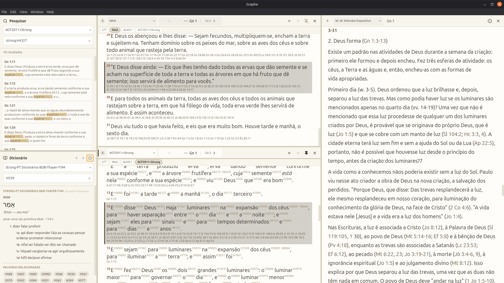

# Graphe

Um aplicativo moderno para estudo bíblico, com foco em leitura, comparação e pesquisa das Escrituras.

O Graphe oferece uma interface limpa e atual para leitura, pesquisa e análise profunda das Escrituras, com suporte a painéis divididos, números de Strong, referências cruzadas e múltiplas traduções.

Disponível para **Windows**, **Linux** e **macOS**.



## Download

Baixe a versão mais recente para o seu sistema operacional na página de [releases](https://github.com/claudioscheer/graphe/releases/latest).

## Funcionalidades

### Traduções Bíblicas

- Suporte a múltiplas traduções abertas simultaneamente
- Sistema de painéis divididos (horizontal e vertical) para comparar traduções lado a lado
- Navegação rápida por livro, capítulo e versículo

### Números de Strong

- Exibição dos números de Strong (Hebraico e Grego) integrados ao texto bíblico
- Consulta a dicionários de Strong com um clique
- Suporte a múltiplos dicionários (Almeida, Strong-PT, BDB)
- Exibição de cognatos e palavras relacionadas

### Referências Cruzadas

- Integração com o Treasury of Scripture Knowledge (TSK)
- Navegação direta para versículos referenciados
- Suporte a múltiplos módulos de referências cruzadas
- Opção de abrir referências em modal de prévia (painel fixado)

### Comentários Bíblicos

- Suporte a módulos de comentário (ex: Matthew Henry, Jamieson-Fausset-Brown)
- Visualização sincronizada com o texto bíblico — o comentário acompanha o capítulo aberto
- Abertura em painel dividido (horizontal ou vertical)
- Vinculação flexível: escolha qual painel bíblico atualiza cada comentário

### Compatibilidade com Módulos MyBible (SQLite3)

- Utiliza módulos no formato **MyBible SQLite3**
- Suporte a módulos de **Bíblias, Dicionários, Referências Cruzadas e Comentários**
- O tipo do módulo é detectado automaticamente a partir da estrutura do banco de dados
- Suporte estendido para anotações interlineares por palavra (quando presentes no módulo):
  - número de Strong
  - palavra original
  - transcrição

#### Instalando módulos

Use o instalador de módulos do próprio Graphe:

1. Abra o menu **File > Install Modules...** (ou clique em **Instalar Módulos** quando o app não encontrar módulos bíblicos).
2. Selecione um ou mais arquivos de módulo MyBible (`.SQLite3`/SQLite válidos).
3. O Graphe instala os módulos automaticamente e recarrega a interface quando a instalação for concluída.

Os arquivos selecionados são copiados automaticamente para a pasta de módulos do Graphe:

| Sistema  | Caminho                           |
| -------- | --------------------------------- |
| Linux    | `~/.graphe/modules/`              |
| macOS    | `~/.graphe/modules/`              |
| Windows  | `%USERPROFILE%\\.graphe\\modules\\` |

O tipo do módulo (Bíblia, Dicionário, Referências Cruzadas ou Comentário) é detectado automaticamente a partir das tabelas no banco de dados.

### Conversão de módulos theWord para MyBible

- O Graphe converte módulos do theWord para módulos MyBible SQLite3
- Entrada suportada no conversor:
  - Bíblias do theWord: `.ont`, `.nt`, `.ot`
  - Comentários e dicionários do theWord: `.twm`
- Saída do conversor:
  - Bíblia: `.SQLite3`
  - Comentário: `.commentaries.SQLite3`
  - Dicionário: `.dictionary.SQLite3`

Após a instalação, acesse as **Configurações** para verificar e organizar os módulos instalados.

### Pesquisa

- Busca textual em todos os versículos
- Busca por números de Strong (ex: `strong:H1234`)

### Interface

- Temas claro e escuro
- Tamanho de fonte ajustável
- Disponível em Português, Inglês e Espanhol
- Seleção e cópia de versículos com `Ctrl+C`
- Atalhos de teclado para navegação rápida

### Atalhos de Teclado

| Atalho | Ação |
| --- | --- |
| `Ctrl+Shift+F` | Focar no campo de pesquisa |
| `F3` | Abrir diálogo de navegação (livro/capítulo/versículo) |
| `Ctrl+T` | Abrir seletor de tradução no painel ativo |
| `Ctrl+Shift+T` | Alternar entre traduções favoritas |
| `Ctrl+A` | Selecionar todos os versículos no painel ativo |
| `Ctrl+C` | Copiar versículos selecionados |
| `Tab` | Alternar entre painéis |
| `↑` / `↓` | Navegar entre versículos |
| `Shift+↑` / `Shift+↓` | Estender seleção de versículos |
| `Escape` | Fechar diálogos/overlays/popovers |

> No macOS, use `Cmd` no lugar de `Ctrl`.

## Problemas ou Sugestões

Encontrou um bug ou tem uma ideia para melhorar o Graphe? Abra uma issue no [GitHub](https://github.com/claudioscheer/graphe/issues).

## Desenvolvimento

### Pré-requisitos

- Node.js
- npm

### Instalação

```bash
npm install
```

### Executar em modo de desenvolvimento

```bash
npm run dev
```

### Gerar pacote

```bash
npm run make
```

## Licença

MIT
